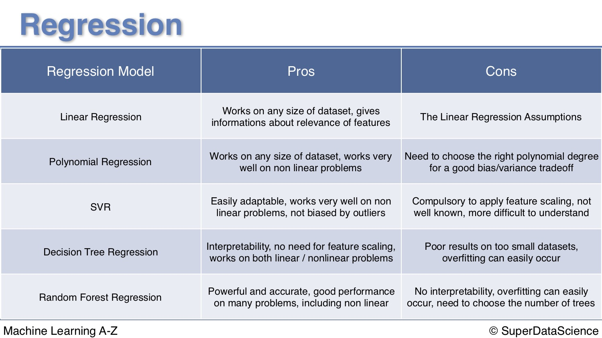

# Regression

## Simple Linear Regression

```python

# Importing the dataset
dataset = pd.read_csv('Salary_Data.csv')
X = dataset.iloc[:, :-1].values
y = dataset.iloc[:, 1].values

# Splitting the dataset into the Training set and Test set
from sklearn.cross_validation import train_test_split
X_train, X_test, y_train, y_test = train_test_split(X, y, test_size = 1/3, random_state = 0)

# Fitting Simple Linear Regression to the Training set
from sklearn.linear_model import LinearRegression
regressor = LinearRegression()
regressor.fit(X_train, y_train)

# Predicting the Test set results
y_pred = regressor.predict(X_test)

# Compute and print R^2 and RMSE
print("R^2: {}".format(regressor.score(X_test, y_test)))
rmse = np.sqrt(mean_squared_error(y_test,y_pred))
print("Root Mean Squared Error: {}".format(rmse))

# Visualising the Training set results
plt.scatter(X_train, y_train, color = 'red')
plt.plot(X_train, regressor.predict(X_train), color = 'blue')
plt.title('Salary vs Experience (Training set)')
plt.xlabel('Years of Experience')
plt.ylabel('Salary')
plt.show()

# Visualising the Test set results
plt.scatter(X_test, y_test, color = 'red')
plt.plot(X_train, regressor.predict(X_train), color = 'blue')
plt.title('Salary vs Experience (Test set)')
plt.xlabel('Years of Experience')
plt.ylabel('Salary')
plt.show()
```

#### R

```r
# Simple Linear Regression

# Importing the dataset
dataset = read.csv('Salary_Data.csv')

# Splitting the dataset into the Training set and Test set
# install.packages('caTools')
library(caTools)
set.seed(123)
split = sample.split(dataset$Salary, SplitRatio = 2/3)
training_set = subset(dataset, split == TRUE)
test_set = subset(dataset, split == FALSE)

# Feature Scaling
# training_set = scale(training_set)
# test_set = scale(test_set)

# Fitting Simple Linear Regression to the Training set
regressor = lm(formula = Salary ~ YearsExperience,
               data = training_set)

# Predicting the Test set results
y_pred = predict(regressor, newdata = test_set)

# Visualising the Training set results
library(ggplot2)
ggplot() +
  geom_point(aes(x = training_set$YearsExperience, y = training_set$Salary),
             colour = 'red') +
  geom_line(aes(x = training_set$YearsExperience, y = predict(regressor, newdata = training_set)),
            colour = 'blue') +
  ggtitle('Salary vs Experience (Training set)') +
  xlab('Years of experience') +
  ylab('Salary')

# Visualising the Test set results
library(ggplot2)
ggplot() +
  geom_point(aes(x = test_set$YearsExperience, y = test_set$Salary),
             colour = 'red') +
  geom_line(aes(x = training_set$YearsExperience, y = predict(regressor, newdata = training_set)),
            colour = 'blue') +
  ggtitle('Salary vs Experience (Test set)') +
  xlab('Years of experience') +
  ylab('Salary')
```

## P-value

The p-value is actually the probability of getting a sample like ours, or more extreme than ours IF the null hypothesis is true. 

## Stepwise  Model Selection

### Backward Elimination\(fastest one\)

1. select a significant level to stay in the model\(0.05\)
2. fit the full model with all variables
3. consider the variables with highest p value, if p&gt;SL, to step4, else to step5
4. drop that predictor
5. fit the model without the predictor again

### Forward Selection

1. select a significant level to stay in the model\(0.05\)
2. fit the model with one predictor, select the one with lowest p-value
3. consider the variables with highest p value, if p&gt;SL, to step4, else to step5
4. add one more predictor, select one with lowest p-value, if p-value&lt;SL, to step3, else go to final model
5. fit the model the final number of predictor again

### Bidirectional Elimination

1. select a significant level to stay in the model, SLENTER=0.05, SLSTAY=0.05
2. perform step 2 in forward selection\(new value:p&lt;SLENTER to enter\)
3. perform backward elimination\(p&lt;SLSTAY to stay\), then go back to step 2
4. when the iteration break, we have the final model

## Multiple Linear Regression

```python
# Multiple Linear Regression

# Encoding categorical data
from sklearn.preprocessing import LabelEncoder, OneHotEncoder
labelencoder = LabelEncoder()
X[:, 3] = labelencoder.fit_transform(X[:, 3])
onehotencoder = OneHotEncoder(categorical_features = [3])
X = onehotencoder.fit_transform(X).toarray()

# Avoiding the Dummy Variable Trap #Python can do it automatically
X = X[:, 1:]

# Splitting the dataset into the Training set and Test set
from sklearn.cross_validation import train_test_split
X_train, X_test, y_train, y_test = train_test_split(X, y, test_size = 0.2, random_state = 0)

# Fitting Multiple Linear Regression to the Training set
from sklearn.linear_model import LinearRegression
regressor = LinearRegression()
regressor.fit(X_train, y_train)

# Predicting the Test set results
y_pred = regressor.predict(X_test)
```

### Backward Elimination

```python
import statsmodels.formula.api as sm
X = np.append(arr = np.ones((50, 1)).astype(int), values = X, axis = 1)
X_opt = X[:, [0, 1, 2, 3, 4, 5]]
regressor_OLS = sm.OLS(endog = y, exog = X_opt).fit()
regressor_OLS.summary()
X_opt = X[:, [0, 1, 3, 4, 5]]
regressor_OLS = sm.OLS(endog = y, exog = X_opt).fit()
regressor_OLS.summary()
X_opt = X[:, [0, 3, 4, 5]]
regressor_OLS = sm.OLS(endog = y, exog = X_opt).fit()
regressor_OLS.summary()
X_opt = X[:, [0, 3, 5]]
regressor_OLS = sm.OLS(endog = y, exog = X_opt).fit()
regressor_OLS.summary()
X_opt = X[:, [0, 3]]
regressor_OLS = sm.OLS(endog = y, exog = X_opt).fit()
regressor_OLS.summary()
```

### Backward Elimination with p-values

```text
import statsmodels.formula.api as sm
def backwardElimination(x, sl):
    numVars = len(x[0])
    for i in range(0, numVars):
        regressor_OLS = sm.OLS(y, x).fit()
        maxVar = max(regressor_OLS.pvalues).astype(float)
        if maxVar > sl:
            for j in range(0, numVars - i):
                if (regressor_OLS.pvalues[j].astype(float) == maxVar):
                    x = np.delete(x, j, 1)
    regressor_OLS.summary()
    return x
 
SL = 0.05
X_opt = X[:, [0, 1, 2, 3, 4, 5]]
X_Modeled = backwardElimination(X_opt, SL)
```

### Backward Elimination with p-values and Adjusted R

```text
import statsmodels.formula.api as sm
def backwardElimination(x, SL):
    numVars = len(x[0])
    temp = np.zeros((50,6)).astype(int)
    for i in range(0, numVars):
        regressor_OLS = sm.OLS(y, x).fit()
        maxVar = max(regressor_OLS.pvalues).astype(float)
        adjR_before = regressor_OLS.rsquared_adj.astype(float)
        if maxVar > SL:
            for j in range(0, numVars - i):
                if (regressor_OLS.pvalues[j].astype(float) == maxVar):
                    temp[:,j] = x[:, j]
                    x = np.delete(x, j, 1)
                    tmp_regressor = sm.OLS(y, x).fit()
                    adjR_after = tmp_regressor.rsquared_adj.astype(float)
                    if (adjR_before >= adjR_after):
                        x_rollback = np.hstack((x, temp[:,[0,j]]))
                        x_rollback = np.delete(x_rollback, j, 1)
                        print (regressor_OLS.summary())
                        return x_rollback
                    else:
                        continue
    regressor_OLS.summary()
    return x
 
SL = 0.05
X_opt = X[:, [0, 1, 2, 3, 4, 5]]
X_Modeled = backwardElimination(X_opt, SL)
```

### Multiple Regression in R

```text
library(tidyverse)
library(caret)
library(leaps)
library(MASS)

#####################################Method 1#######################
# Fit the full model 
full.model <- lm(Fertility ~., data = swiss)
# Stepwise regression model
step.model <- stepAIC(full.model, direction = "both", 
                      trace = FALSE)
summary(step.model)
#####################################Method 2#######################
#nvmax:maximum number of predictors to be incorporated in the model.
models <- regsubsets(Fertility~., data = swiss, nvmax = 5,
                     method = "seqrep")
summary(models)

#####################################Method 3#######################
# Set seed for reproducibility
set.seed(123)
# Set up repeated k-fold cross-validation
train.control <- trainControl(method = "cv", number = 10)
# Train the model
step.model <- train(Fertility ~., data = swiss,
                    method = "leapBackward", 
                    tuneGrid = data.frame(nvmax = 1:5),
                    trControl = train.control
                    )
step.model$results
step.model$bestTune

#####################################Method 5#######################
# Train the model
step.model <- train(Fertility ~., data = swiss,
                    method = "lmStepAIC", 
                    trControl = train.control,
                    trace = FALSE
                    )
# Model accuracy
step.model$results
# Final model coefficients
step.model$finalModel
# Summary of the model
summary(step.model$finalModel)
```

## Polynominal Regression

```python
# Polynomial Regression

# Importing the libraries
import numpy as np
import matplotlib.pyplot as plt
import pandas as pd

# Importing the dataset
dataset = pd.read_csv('Position_Salaries.csv')
X = dataset.iloc[:, 1:2].values
y = dataset.iloc[:, 2].values

# Fitting Polynomial Regression to the dataset
from sklearn.preprocessing import PolynomialFeatures
poly_reg = PolynomialFeatures(degree = 4)  #select the best degree
X_poly = poly_reg.fit_transform(X)
poly_reg.fit(X_poly, y)
lin_reg_2 = LinearRegression()
lin_reg_2.fit(X_poly, y)


# Visualising the Polynomial Regression results
plt.scatter(X, y, color = 'red')
plt.plot(X, lin_reg_2.predict(poly_reg.fit_transform(X)), color = 'blue')
plt.title('Truth or Bluff (Polynomial Regression)')
plt.xlabel('Position level')
plt.ylabel('Salary')
plt.show()

# Visualising the Polynomial Regression results (for higher resolution and smoother curve)
X_grid = np.arange(min(X), max(X), 0.1)
X_grid = X_grid.reshape((len(X_grid), 1))
plt.scatter(X, y, color = 'red')
plt.plot(X_grid, lin_reg_2.predict(poly_reg.fit_transform(X_grid)), color = 'blue')
plt.title('Truth or Bluff (Polynomial Regression)')
plt.xlabel('Position level')
plt.ylabel('Salary')
plt.show()

# Predicting a new result with Polynomial Regression
lin_reg_2.predict(poly_reg.fit_transform(6.5))
```

## Problems with stepwise regression



## Ridge and Lasso Regression

R example only


Ridge regression and the lasso are closely related, but only the Lasso  
has the ability to select predictors.



Ridge regression includes an additional ‘shrinkage’ term λ. Two interesting implications of this design are the facts that when λ = 0 the OLS coefficients are returned and when λ = ∞, coefficients will approach zero.



[https://www.superdatascience.com/wp-content/uploads/2017/02/Regularization.pdf](https://www.superdatascience.com/wp-content/uploads/2017/02/Regularization.pdf)


### Ridge

```python
# Import necessary modules
from sklearn.linear_model import Ridge
from sklearn.model_selection import cross_val_score

# Setup the array of alphas and lists to store scores
alpha_space = np.logspace(-4, 0, 50)
ridge_scores = []
ridge_scores_std = []

# Create a ridge regressor: ridge
ridge = Ridge(normalize=True)

# Compute scores over range of alphas
for alpha in alpha_space:

    # Specify the alpha value to use: ridge.alpha
    ridge.alpha = alpha
    
    # Perform 10-fold CV: ridge_cv_scores
    ridge_cv_scores = cross_val_score(ridge,X,y,cv=10)
    
    # Append the mean of ridge_cv_scores to ridge_scores
    ridge_scores.append(np.mean(ridge_cv_scores))
    
    # Append the std of ridge_cv_scores to ridge_scores_std
    ridge_scores_std.append(np.std(ridge_cv_scores))

# Display the plot
display_plot(ridge_scores, ridge_scores_std)
def display_plot(cv_scores, cv_scores_std):
    fig = plt.figure()
    ax = fig.add_subplot(1,1,1)
    ax.plot(alpha_space, cv_scores)

    std_error = cv_scores_std / np.sqrt(10)

    ax.fill_between(alpha_space, cv_scores + std_error, cv_scores - std_error, alpha=0.2)
    ax.set_ylabel('CV Score +/- Std Error')
    ax.set_xlabel('Alpha')
    ax.axhline(np.max(cv_scores), linestyle='--', color='.5')
    ax.set_xlim([alpha_space[0], alpha_space[-1]])
    ax.set_xscale('log')
    plt.show()
```

```r
# Load libraries, get data & set seed for reproducibility ---------------------
set.seed(123)    # seef for reproducibility
library(glmnet)  # for ridge regression
library(dplyr)   # for data cleaning
library(psych)   # for function tr() to compute trace of a matrix

data("mtcars")
# Center y, X will be standardized in the modelling function
y <- mtcars %>% select(mpg) %>% scale(center = TRUE, scale = FALSE) %>% as.matrix()
X <- mtcars %>% select(-mpg) %>% as.matrix()

# Perform 10-fold cross-validation to select lambda ---------------------------
lambdas_to_try <- 10^seq(-3, 5, length.out = 100)
# Setting alpha = 0 implements ridge regression
ridge_cv <- cv.glmnet(X, y, alpha = 0, lambda = lambdas_to_try,
                      standardize = TRUE, nfolds = 10)
# Plot cross-validation results
plot(ridge_cv)
cv.ridge$lambda.min
cv.ridge$lambda.lse
coef(cv.ridge, s=cv.ridge$lambda.min)
```

### Lasso

\(least absolute shrinkage and selection operator\)

```python
# Import Lasso
from sklearn.linear_model import Lasso

# Instantiate a lasso regressor: lasso
lasso = Lasso(alpha=0.4,normalize=True)

# Fit the regressor to the data
lasso.fit(X,y)

# Compute and print the coefficients
lasso_coef = lasso.coef_
print(lasso_coef)

# Plot the coefficients
plt.plot(range(len(df_columns)),lasso_coef)
plt.xticks(range(len(df_columns)),df_columns.values, rotation=60)
plt.margins(0.02)
plt.show()

```

```r
# Perform 10-fold cross-validation to select lambda ---------------------------
lambdas_to_try <- 10^seq(-3, 5, length.out = 100)
# Setting alpha = 1 implements lasso regression
lasso_cv <- cv.glmnet(X, y, alpha = 1, lambda = lambdas_to_try,
                      standardize = TRUE, nfolds = 10)
# Results
plot(cv.lasso)
plot(cv.lasso$glmnet.fit, xvar="lambda", label=TRUE)
cv.lasso$lambda.min
cv.lasso$lambda.1se
coef(cv.lasso, s=cv.lasso$lambda.min)
```

### LASSO vs Ridge

> * Often neither one is overall better.
> * Lasso can set some coefficients to zero, thus performing variable selection, while ridge regression cannot.
> * Both methods allow to use correlated predictors, but they solve multicollinearity issue differently:
>   * In ridge regression, the coefficients of correlated predictors are similar;
>   * In lasso, one of the correlated predictors has a larger coefficient, while the rest are \(nearly\) zeroed.
> * Lasso tends to do well if there are a small number of significant parameters and the others are close to zero \(ergo: when only a few predictors actually influence the response\).
> * Ridge works well if there are many large parameters of about the same value \(ergo: when most predictors impact the response\).
> * However, in practice, we don't know the true parameter values, so the previous two points are somewhat theoretical. Just run cross-validation to select the more suited model for a specific case.
> * Or... combine the two!

### **Elastic net regression**


For elastic net regression, you need to choose a value of alpha somewhere between 0 and 1. 


> **Here is a great article:**



```text
library(caret)

# Set training control
train_control <- trainControl(method = "repeatedcv",
                              number = 5,
                              repeats = 5,
                              search = "random",
                              verboseIter = TRUE)
# Train the model
elastic_net_model <- train(mpg ~ .,
                           data = cbind(y, X),
                           method = "glmnet",
                           preProcess = c("center", "scale"),
                           tuneLength = 25,
                           trControl = train_control)

# Check multiple R-squared
y_hat_enet <- predict(elastic_net_model, X)
rsq_enet <- cor(y, y_hat_enet)^2
```

### Summary

* If your linear model contains many predictor variables or if these variables are correlated, the standard OLS parameter estimates have large variance, thus making the model unreliable.
* To counter this, you can use regularization - a technique allowing to decrease this variance at the cost of introducing some bias. Finding a good bias-variance trade-off allows to minimize the model's total error.
* There are three popular regularization techniques, each of them aiming at decreasing the size of the coefficients:
  * Ridge Regression, which penalizes sum of squared coefficients \(L2 penalty\).
  * Lasso Regression, which penalizes the sum of absolute values of the coefficients \(L1 penalty\).
  * Elastic Net, a convex combination of Ridge and Lasso.
* We can also fit logistic model with LASSO and Ridge



## GAM

GAM\(generalized additive **model\)** are simply a class of statistical Models in which the usual Linear relationship between the Response and Predictors are replaced by several Non linear smooth functions to model and capture the Non linearities in the data.

It's a way to transformed data when you don't have specific knowledge in that domain.



## Support Vector Regression



### SVR intuition

* linear regression try to minimize error between prediction and data

* SVR try to make sure error do not exceed threshold

```python
# SVR

# Importing the libraries
import numpy as np
import matplotlib.pyplot as plt
import pandas as pd

# Importing the dataset
dataset = pd.read_csv('Position_Salaries.csv')
X = dataset.iloc[:, 1:2].values
y = dataset.iloc[:, 2].values

# Splitting the dataset into the Training set and Test set
"""from sklearn.cross_validation import train_test_split
X_train, X_test, y_train, y_test = train_test_split(X, y, test_size = 0.2, random_state = 0)"""

# Feature Scaling
from sklearn.preprocessing import StandardScaler
sc_X = StandardScaler()
sc_y = StandardScaler()
X = sc_X.fit_transform(X)
y = sc_y.fit_transform(y)

# Fitting SVR to the dataset
from sklearn.svm import SVR
regressor = SVR(kernel = 'rbf')
regressor.fit(X, y)

# Predicting a new result
y_pred = regressor.predict(sc_X.transform(np.array([[6.5]])))
y_pred = sc_y.inverse_transform(y_pred)

# Visualising the SVR results
plt.scatter(X, y, color = 'red')
plt.plot(X, regressor.predict(X), color = 'blue')
plt.title('Truth or Bluff (SVR)')
plt.xlabel('Position level')
plt.ylabel('Salary')
plt.show()

# Visualising the SVR results (for higher resolution and smoother curve)
X_grid = np.arange(min(X), max(X), 0.01) # choice of 0.01 instead of 0.1 step because the data is feature scaled
X_grid = X_grid.reshape((len(X_grid), 1))
plt.scatter(X, y, color = 'red')
plt.plot(X_grid, regressor.predict(X_grid), color = 'blue')
plt.title('Truth or Bluff (SVR)')
plt.xlabel('Position level')
plt.ylabel('Salary')
plt.show()
```

```r
# SVR 

# Importing the dataset
dataset = read.csv('Position_Salaries.csv')
dataset = dataset[2:3]

# Splitting the dataset into the Training set and Test set
# # install.packages('caTools')
# library(caTools)
# set.seed(123)
# split = sample.split(dataset$Salary, SplitRatio = 2/3)
# training_set = subset(dataset, split == TRUE)
# test_set = subset(dataset, split == FALSE)

# Feature Scaling
# training_set = scale(training_set)
# test_set = scale(test_set)

# Fitting SVR to the dataset
# install.packages('e1071')
library(e1071)
regressor = svm(formula = Salary ~ .,
                data = dataset,
                type = 'eps-regression',
                kernel = 'radial')

# Predicting a new result
y_pred = predict(regressor, data.frame(Level = 6.5))

# Visualising the SVR results
# install.packages('ggplot2')
library(ggplot2)
ggplot() +
  geom_point(aes(x = dataset$Level, y = dataset$Salary),
             colour = 'red') +
  geom_line(aes(x = dataset$Level, y = predict(regressor, newdata = dataset)),
            colour = 'blue') +
  ggtitle('Truth or Bluff (SVR)') +
  xlab('Level') +
  ylab('Salary')

# Visualising the SVR results (for higher resolution and smoother curve)
# install.packages('ggplot2')
library(ggplot2)
x_grid = seq(min(dataset$Level), max(dataset$Level), 0.1)
ggplot() +
  geom_point(aes(x = dataset$Level, y = dataset$Salary),
             colour = 'red') +
  geom_line(aes(x = x_grid, y = predict(regressor, newdata = data.frame(Level = x_grid))),
            colour = 'blue') +
  ggtitle('Truth or Bluff (SVR)') +
  xlab('Level') +
  ylab('Salary')
```


R scales variables automatically in package e1071


## Decision Tree Regression

> For non-continuous ,non-linear  data

```python
# Decision Tree Regression

# Importing the libraries
import numpy as np
import matplotlib.pyplot as plt
import pandas as pd

# Importing the dataset
dataset = pd.read_csv('Position_Salaries.csv')
X = dataset.iloc[:, 1:2].values
y = dataset.iloc[:, 2].values

# Splitting the dataset into the Training set and Test set
"""from sklearn.cross_validation import train_test_split
X_train, X_test, y_train, y_test = train_test_split(X, y, test_size = 0.2, random_state = 0)"""

# Feature Scaling
"""from sklearn.preprocessing import StandardScaler
sc_X = StandardScaler()
X_train = sc_X.fit_transform(X_train)
X_test = sc_X.transform(X_test)
sc_y = StandardScaler()
y_train = sc_y.fit_transform(y_train)"""

# Fitting Decision Tree Regression to the dataset
from sklearn.tree import DecisionTreeRegressor
regressor = DecisionTreeRegressor(random_state = 0)
regressor.fit(X, y)

# Predicting a new result
y_pred = regressor.predict(6.5)

# Visualising the Decision Tree Regression results (higher resolution)
X_grid = np.arange(min(X), max(X), 0.01)
X_grid = X_grid.reshape((len(X_grid), 1))
plt.scatter(X, y, color = 'red')
plt.plot(X_grid, regressor.predict(X_grid), color = 'blue')
plt.title('Truth or Bluff (Decision Tree Regression)')
plt.xlabel('Position level')
plt.ylabel('Salary')
plt.show()
```

Plot Decision Tree



```r
# Decision Tree Regression

# Importing the dataset
dataset = read.csv('Position_Salaries.csv')
dataset = dataset[2:3]

# Splitting the dataset into the Training set and Test set
# # install.packages('caTools')
# library(caTools)
# set.seed(123)
# split = sample.split(dataset$Salary, SplitRatio = 2/3)
# training_set = subset(dataset, split == TRUE)
# test_set = subset(dataset, split == FALSE)

# Feature Scaling
# training_set = scale(training_set)
# test_set = scale(test_set)

# Fitting Decision Tree Regression to the dataset
# install.packages('rpart')
library(rpart)
regressor = rpart(formula = Salary ~ .,
                  data = dataset,
                  control = rpart.control(minsplit = 1))

# Predicting a new result with Decision Tree Regression
y_pred = predict(regressor, data.frame(Level = 6.5))

# Visualising the Decision Tree Regression results (higher resolution)
# install.packages('ggplot2')
library(ggplot2)
x_grid = seq(min(dataset$Level), max(dataset$Level), 0.01)
ggplot() +
  geom_point(aes(x = dataset$Level, y = dataset$Salary),
             colour = 'red') +
  geom_line(aes(x = x_grid, y = predict(regressor, newdata = data.frame(Level = x_grid))),
            colour = 'blue') +
  ggtitle('Truth or Bluff (Decision Tree Regression)') +
  xlab('Level') +
  ylab('Salary')

# Plotting the tree
plot(regressor)
text(regressor)
```



## Random Forest Regression

1. Pick at random K data points from training set
2. Build a decision tree using these points
3. Choose the number of trees and repeat step 1-2
4. For new data point X, use every tree to predict and take average and get predicted Y

```python
# Random Forest Regression

# Importing the libraries
import numpy as np
import matplotlib.pyplot as plt
import pandas as pd

# Importing the dataset
dataset = pd.read_csv('Position_Salaries.csv')
X = dataset.iloc[:, 1:2].values
y = dataset.iloc[:, 2].values

# Splitting the dataset into the Training set and Test set
"""from sklearn.cross_validation import train_test_split
X_train, X_test, y_train, y_test = train_test_split(X, y, test_size = 0.2, random_state = 0)"""

# Feature Scaling
"""from sklearn.preprocessing import StandardScaler
sc_X = StandardScaler()
X_train = sc_X.fit_transform(X_train)
X_test = sc_X.transform(X_test)
sc_y = StandardScaler()
y_train = sc_y.fit_transform(y_train)"""

# Fitting Random Forest Regression to the dataset
from sklearn.ensemble import RandomForestRegressor
regressor = RandomForestRegressor(n_estimators = 10, random_state = 0)
regressor.fit(X, y)

# Predicting a new result
y_pred = regressor.predict(6.5)

# Visualising the Random Forest Regression results (higher resolution)
X_grid = np.arange(min(X), max(X), 0.01)
X_grid = X_grid.reshape((len(X_grid), 1))
plt.scatter(X, y, color = 'red')
plt.plot(X_grid, regressor.predict(X_grid), color = 'blue')
plt.title('Truth or Bluff (Random Forest Regression)')
plt.xlabel('Position level')
plt.ylabel('Salary')
plt.show()
```

```r
# Random Forest Regression

# Importing the dataset
dataset = read.csv('Position_Salaries.csv')
dataset = dataset[2:3]

# Splitting the dataset into the Training set and Test set
# # install.packages('caTools')
# library(caTools)
# set.seed(123)
# split = sample.split(dataset$Salary, SplitRatio = 2/3)
# training_set = subset(dataset, split == TRUE)
# test_set = subset(dataset, split == FALSE)

# Feature Scaling
# training_set = scale(training_set)
# test_set = scale(test_set)

# Fitting Random Forest Regression to the dataset
# install.packages('randomForest')
library(randomForest)
set.seed(1234)
regressor = randomForest(x = dataset[-2],
                         y = dataset$Salary,
                         ntree = 500)

# Predicting a new result with Random Forest Regression
y_pred = predict(regressor, data.frame(Level = 6.5))

# Visualising the Random Forest Regression results (higher resolution)
# install.packages('ggplot2')
library(ggplot2)
x_grid = seq(min(dataset$Level), max(dataset$Level), 0.01)
ggplot() +
  geom_point(aes(x = dataset$Level, y = dataset$Salary),
             colour = 'red') +
  geom_line(aes(x = x_grid, y = predict(regressor, newdata = data.frame(Level = x_grid))),
            colour = 'blue') +
  ggtitle('Truth or Bluff (Random Forest Regression)') +
  xlab('Level') +
  ylab('Salary')
```

## Pros and Cons



## Model Evaluation


