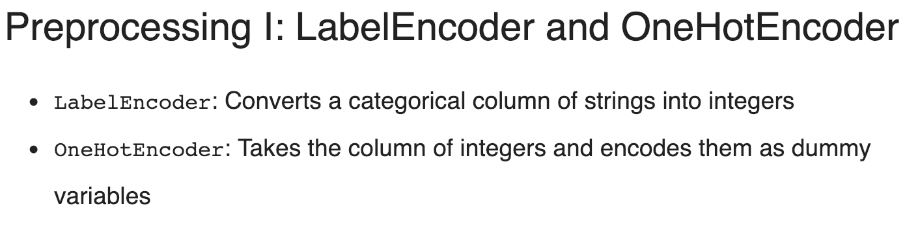

# Ensemble Learning\(XGBoost\)

Before talking about XGBoost, I want to mention one concept that my friend asked me that I could not answer at that time. What is bagging, boosting and stacking? We should get these things clear before we move on to XGBoost.

## Ensemble Learning



### What is Ensemble Learning?

> An ensemble is the art of combining a diverse set of learners \(individual models\) together to improvise on the stability and predictive power of the model.

### Model error and reducing this error with Ensembles <a id="model-error-and-reducing-this-error-with-ensembles-"></a>

The error emerging from any machine model can be broken down into three components mathematically. Following are these component:  
  
                                                **Bias + Variance + Irreducible error**

* **Bias error** is useful to quantify how much on an average are the predicted values different from the actual value. A high bias error means we have an under-performing model which keeps on missing essential trends.
* **Variance** on the other side quantifies how are the prediction made on the same observation different from each other. A high variance model will over-fit on your training population and perform poorly on any observation beyond training.

> Typically, as you increase the complexity of your model, you will see a reduction in error due to lower bias in the model. However, this only happens until a particular point. As you continue to make your model more complex, you end up over-fitting your model, and hence your model will start suffering from the high variance.

### Ensemble learning Types <a id="different-types-of-ensemble-learning-methods-"></a>

**Bagging based Ensemble learning \(Bootstrapping\)**


Also called **Bootstrap Aggregation**, such as random forest


In real experiments, the bootstrapped samples are drawn from the training set, and the sub-models are tested using the testing set. The final output prediction is combined across the projections of all the sub-models.


**Boosting-based Ensemble learning:**

Once the sequence of the models are created the predictions made by models are weighted by their accuracy scores and the results are combined to create a final estimation.Models that are typically used in Boosting technique are XGBoost \(Extreme Gradient Boosting\), GBM \(Gradient Boosting Machine\), ADABoost \(Adaptive Boosting\), etc.


A family of machine learning algorithms that convert weak learners to strong ones.

Weak Learner such as decision tree, which is slightly better than random guess.


**Voting based Ensemble learning:**

The method starts with creating two or more separate models with the same dataset. Then a Voting based Ensemble model can be used to wrap the previous models and aggregate the predictions of those models. 

After the Voting based Ensemble model is constructed, it can be used to make a prediction on new data. The predictions made by the sub-models can be assigned weights. 

**Stacked aggregation** is a technique which can be used to learn how to weigh these predictions in the best possible way.

### Pros and Cons

For example, if you have models with high variance \(they over-fit your data\), then you are likely to benefit from using bagging. If you have biased models, it is better to combine them with Boosting. There are also different strategies to form ensembles. The topic is just too broad to cover it in one answer.

## XGBoost



```python
# Import xgboost
import xgboost as xgb

# Importing the libraries
import numpy as np
import matplotlib.pyplot as plt
import pandas as pd
from sklearn.model_selection import train_test_split

# Create arrays for the features and the target: X, y
X, y = churn_data.iloc[:,:-1], churn_data.iloc[:,-1]

# Create the training and test sets
X_train, X_test, y_train, y_test= train_test_split(X, y, test_size=0.2, random_state=123)

# Instantiate the XGBClassifier: xg_cl
xg_cl = xgb.XGBClassifier(objective='binary:logistic', n_estimators=10, seed=123)

# Fit the classifier to the training set
xg_cl.fit(X_train,y_train)

# Predict the labels of the test set: preds
preds = xg_cl.predict(X_test)

# Compute the accuracy: accuracy
accuracy = float(np.sum(preds==y_test))/y_test.shape[0]
print("accuracy: %f" % (accuracy))

```


Perform 3-fold cross-validation by calling `xgb.cv()`. `dtrain` is your `churn_dmatrix`, `params` is your parameter dictionary, `folds` is the number of cross-validation folds \(3\), `num_boosting_rounds` is the number of trees we want to build \(5\), `metrics` is the metric you want to compute \(this will be `"error"`, which we will convert to an accuracy\).


### Measure performance

#### Accuracy

```python
# Create the DMatrix: churn_dmatrix
churn_dmatrix = xgb.DMatrix(data=X, label=y)

# Create the parameter dictionary: params
params = {"objective":"reg:logistic", "max_depth":3}

# Perform cross-validation: cv_results
cv_results = xgb.cv(dtrain=churn_dmatrix, params=params, nfold=3, num_boost_round=5, metrics="error", as_pandas=True, seed=123)

# Print cv_results
print(cv_results)

# Print the accuracy
print(((1-cv_results["test-error-mean"]).iloc[-1]))
```

#### AUC

```python
# Perform cross_validation: cv_results
cv_results = xgb.cv(dtrain=churn_dmatrix, params=params, nfold=3, num_boost_round=5, metrics="auc", as_pandas=True, seed=123)

# Print cv_results
print(cv_results)

# Print the AUC
print((cv_results["test-auc-mean"]).iloc[-1])
```

### Usage of XGBoost


## How to use XGBoost

### Select Correct Loss Function


### Decision trees as base learners

```python
# Create the training and test sets
X_train, X_test, y_train, y_test= train_test_split(X, y, test_size=0.2, random_state=123)

# Instantiate the XGBRegressor: xg_reg
xg_reg = xgb.XGBRegressor(objective="reg:linear", n_estimators=10, seed=123)

# Fit the regressor to the training set
xg_reg.fit(X_train, y_train)

# Predict the labels of the test set: preds
preds = xg_reg.predict(X_test)

# Compute the rmse: rmse
rmse = np.sqrt(mean_squared_error(y_test, preds))
print("RMSE: %f" % (rmse))
```

### Linear Learner as base learners（rarely used\)

```python
# Convert the training and testing sets into DMatrixes: DM_train, DM_test
DM_train = xgb.DMatrix(data=X_train, label=y_train)
DM_test =  xgb.DMatrix(data=X_test,label=y_test)

# Create the parameter dictionary: params
params = {"booster":"gblinear", "objective":"reg:linear"}

# Train the model: xg_reg
xg_reg = xgb.train(params = params, dtrain=DM_train, num_boost_round=5)

# Predict the labels of the test set: preds
preds = xg_reg.predict(DM_test)

# Compute and print the RMSE
rmse = np.sqrt(mean_squared_error(y_test,preds))
print("RMSE: %f" % (rmse))
```

### Evaluate Model

```python
# Create the DMatrix: housing_dmatrix
housing_dmatrix = xgb.DMatrix(data=X,label=y)

# Create the parameter dictionary: params
params = {"objective":"reg:linear", "max_depth":4}

# Perform cross-validation: cv_results
cv_results = xgb.cv(dtrain=housing_dmatrix, params=params, nfold=4, num_boost_round=5, metrics="rmse", as_pandas=True, seed=123)

# Print cv_results
print(cv_results)

# Extract and print final round boosting round metric
print((cv_results["test-rmse-mean"]).tail(1))
```

### Regularization


```python
#L1
import xgboost as xgb
import pandas as pd
boston_data = pd.read_csv("boston_data.csv")
X,y = boston_data.iloc[:,:-1],boston_data.iloc[:,-1]
boston_dmatrix = xgb.DMatrix(data=X,label=y)
params={"objective":"reg:linear","max_depth":4}
l1_params = [1,10,100]
rmses_l1=[]
for reg in l1_params:
        params["alpha"] = reg
        cv_results = xgb.cv(dtrain=boston_dmatrix,
        params=params,nfold=4,
        num_boost_round=10,metrics="rmse",as_pandas=True,seed=123)
        rmses_l1.append(cv_results["test-rmse-mean"].tail(1).values[0])
print("Best rmse as a function of l1:")
print(pd.DataFrame(list(zip(l1_params,rmses_l1)),columns=["l1","rmse"]))

```

```python
#L2
# Create the DMatrix: housing_dmatrix
housing_dmatrix = xgb.DMatrix(data=X, label=y)

reg_params = [1, 10, 100]

# Create the initial parameter dictionary for varying l2 strength: params
params = {"objective":"reg:linear","max_depth":3}

# Create an empty list for storing rmses as a function of l2 complexity
rmses_l2 = []

# Iterate over reg_params
for reg in reg_params:

    # Update l2 strength
    params["lambda"] = reg
    
    # Pass this updated param dictionary into cv
    cv_results_rmse = xgb.cv(dtrain=housing_dmatrix, params=params, nfold=2, num_boost_round=5, metrics="rmse", as_pandas=True, seed=123)
    
    # Append best rmse (final round) to rmses_l2
    rmses_l2.append(cv_results_rmse["test-rmse-mean"].tail(1).values[0])

# Look at best rmse per l2 param
print("Best rmse as a function of l2:")
print(pd.DataFrame(list(zip(reg_params, rmses_l2)), columns=["l2", "rmse"]))

```

### Visualized XGBoost

```text
# Create the DMatrix: housing_dmatrix
housing_dmatrix = xgb.DMatrix(data=X, label=y)

# Create the parameter dictionary: params
params = {"objective":"reg:linear", "max_depth":2}

# Train the model: xg_reg
xg_reg = xgb.train(params=params, dtrain=housing_dmatrix, num_boost_round=10)

# Plot the first tree
xgb.plot_tree(xg_reg, num_trees=0)
plt.show()

# Plot the fifth tree
xgb.plot_tree(xg_reg, num_trees=4)
plt.show()

# Plot the last tree sideways
xgb.plot_tree(xg_reg, num_trees=9, rankdir="LR")
plt.show()
```

### Feature Selection\(Importance\)

```python
# Create the DMatrix: housing_dmatrix
housing_dmatrix = xgb.DMatrix(data=X, label=y)

# Create the parameter dictionary: params
params = {"objective":"reg:linear", "max_depth":4}

# Train the model: xg_reg
xg_reg = xgb.train(params=params, dtrain=housing_dmatrix, num_boost_round=10)

# Plot the feature importances
xgb.plot_importance(xg_reg)
plt.show()
```

### Fine-Tuning Model -1

#### Tree Model


#### Number of Tree

```python
# Create your housing DMatrix: housing_dmatrix
housing_dmatrix = xgb.DMatrix(data=X, label=y)

# Create the parameter dictionary for each tree: params
params = {"objective":"reg:linear", "max_depth":4}

# Perform cross-validation with early stopping: cv_results
cv_results = xgb.cv(dtrain=housing_dmatrix,params=params,early_stopping_rounds=10,num_boost_round=50,metrics="rmse",seed=123,as_pandas=True,nfold=3)

# Print cv_results
print(cv_results)
```

#### Learning Rate

```python
# Create your housing DMatrix: housing_dmatrix
housing_dmatrix = xgb.DMatrix(data=X, label=y)

# Create the parameter dictionary for each tree (boosting round)
params = {"objective":"reg:linear", "max_depth":3}

# Create list of eta values and empty list to store final round rmse per xgboost model
eta_vals = [0.001, 0.01, 0.1]
best_rmse = []

# Systematically vary the eta 
for curr_val in eta_vals:

    params["eta"] = curr_val
    
    # Perform cross-validation: cv_results
    cv_results = xgb.cv(nfold=3,early_stopping_rounds=5,num_boost_round=10,metrics="rmse",seed=123,as_pandas=True,params=params,dtrain=housing_dmatrix)
    
    
    
    # Append the final round rmse to best_rmse
    best_rmse.append(cv_results["test-rmse-mean"].tail().values[-1])

# Print the resultant DataFrame
print(pd.DataFrame(list(zip(eta_vals, best_rmse)), columns=["eta","best_rmse"]))
```

#### Tuning max\_depth

```python
# Create your housing DMatrix
housing_dmatrix = xgb.DMatrix(data=X,label=y)

# Create the parameter dictionary
params = {"objective":"reg:linear"}

# Create list of max_depth values
max_depths = [2,5,10,20]
best_rmse = []

# Systematically vary the max_depth
for curr_val in max_depths:

    params["max_depth"] = curr_val
    
    # Perform cross-validation
    cv_results = xgb.cv(nfold=2,early_stopping_rounds=5,metrics="rmse",seed=123,num_boost_round=10,dtrain=housing_dmatrix,as_pandas=True,params=params)
    
    
    
    # Append the final round rmse to best_rmse
    best_rmse.append(cv_results["test-rmse-mean"].tail().values[-1])

# Print the resultant DataFrame
print(pd.DataFrame(list(zip(max_depths, best_rmse)),columns=["max_depth","best_rmse"]))
```

#### Tuning colsample\_bytree\(max\_features\)

```python
# Create your housing DMatrix
housing_dmatrix = xgb.DMatrix(data=X,label=y)

# Create the parameter dictionary
params={"objective":"reg:linear","max_depth":3}

# Create list of hyperparameter values: colsample_bytree_vals
colsample_bytree_vals = [0.1,0.5,0.8,1]
best_rmse = []

# Systematically vary the hyperparameter value 
for curr_val in colsample_bytree_vals:

    eta = ["curr_val"]
    
    # Perform cross-validation
    cv_results = xgb.cv(dtrain=housing_dmatrix, params=params, nfold=2,
                 num_boost_round=10, early_stopping_rounds=5,
                 metrics="rmse", as_pandas=True, seed=123)
    
    # Append the final round rmse to best_rmse
    best_rmse.append(cv_results["test-rmse-mean"].tail().values[-1])

# Print the resultant DataFrame
print(pd.DataFrame(list(zip(colsample_bytree_vals, best_rmse)), columns=["colsample_bytree","best_rmse"]))
```

#### Linear Tree


### Fine-Tuning Model -2\(Grid Search and Random Search\)

#### Grid Search

* Search exhaustively over a given set of hyperparameters, once per set of hyperparameters

* Number of models = number of distinct values per hyperparameter multiplied across each hyperparameter

```python
In [1]: import pandas as pd
In [2]: import xgboost as xgb
In [3]: import numpy as np
In [4]: from sklearn.model_selection import GridSearchCV
In [5]: housing_data = pd.read_csv("ames_housing_trimmed_processed.csv")
In [6]: X, y = housing_data[housing_data.columns.tolist()[:-1]],
   ...: housing_data[housing_data.columns.tolist()[-1]
In [7]: housing_dmatrix = xgb.DMatrix(data=X,label=y)
In [8]: gbm_param_grid = {
   ...: 'learning_rate': [0.01,0.1,0.5,0.9],
   ...: 'n_estimators': [200],
   ...: 'subsample': [0.3, 0.5, 0.9]}
In [9]: gbm = xgb.XGBRegressor()
In [10]: grid_mse = GridSearchCV(estimator=gbm,
    ...: param_grid=gbm_param_grid, 
    ...: scoring='neg_mean_squared_error', cv=4, verbose=1)
In [11]: grid_mse.fit(X, y)
In [12]: print("Best parameters found: ",grid_mse.best_params_)
Best parameters found: {'learning_rate': 0.1, 
'n_estimators': 200, 'subsample': 0.5}
```

#### Random Search

* Create a \(possibly infinite\) range of hyperparameter values per hyperparameter that you would like to search over
* Set the number of iterations you would like for the random search to continue
* During each iteration, randomly draw a value in the range of specified values for each hyperparameter searched over and train/evaluate a model with those hyperparameters
* After you've reached the maximum number of iterations, select the hyperparameter configuration with the best evaluated score

```python
In [1]: import pandas as pd
In [2]: import xgboost as xgb
In [3]: import numpy as np
In [4]: from sklearn.model_selection import RandomizedSearchCV
In [5]: housing_data = pd.read_csv("ames_housing_trimmed_processed.csv")
In [6]: X,y = housing_data[housing_data.columns.tolist()[:-1]],
   ...: housing_data[housing_data.columns.tolist()[-1]]
In [7]: housing_dmatrix = xgb.DMatrix(data=X,label=y)
In [8]: gbm_param_grid = {
   ...: 'learning_rate': np.arange(0.05,1.05,.05),
   ...: 'n_estimators': [200],
   ...: 'subsample': np.arange(0.05,1.05,.05)}
In [9]: gbm = xgb.XGBRegressor()
In [10]: randomized_mse = RandomizedSearchCV(estimator=gbm,
    ...: param_distributions=gbm_param_grid, n_iter=25,
    ...: scoring='neg_mean_squared_error', cv=4, verbose=1)
In [11]: randomized_mse.fit(X, y)
In [12]: print("Best parameters found: ",randomized_mse.best_params_)
Best parameters found: {'subsample': 0.60000000000000009,
'n_estimators': 200, 'learning_rate': 0.20000000000000001}
In [13]: print("Lowest RMSE found: ", np.sqrt(np.abs(randomized_mse.best_score_)))
```

## Using Pipeline in XGBoost

### SK-learn example in Random forest

```python
In [1]: import pandas as pd
   ...: from sklearn.ensemble import RandomForestRegressor
   ...: import numpy as np
   ...: from sklearn.preprocessing import StandardScaler
   ...: from sklearn.pipeline import Pipeline
   ...: from sklearn.model_selection import cross_val_score
In [2]: names = ["crime","zone","industry","charles",
   ...: "no","rooms","age", "distance",
   ...: "radial","tax","pupil","aam","lower","med_price"]

In [3]: data = pd.read_csv("boston_housing.csv",names=names)

In [4]: X, y = data.iloc[:,:-1], data.iloc[:,-1]
In [5]: rf_pipeline = Pipeline[("st_scaler", 
   ...: StandardScaler()),
   ...: ("rf_model",RandomForestRegressor())]

In [6]: scores = cross_val_score(rf_pipeline,X,y,    
   ...: scoring="neg_mean_squared_error",cv=10)

In [7]: final_avg_rmse = np.mean(np.sqrt(np.abs(scores)))

In [8]: print("Final RMSE:", final_avg_rmse)
Final RMSE: 4.54530686529
```

### PreprocessingI



```python
# Import LabelEncoder
from sklearn.preprocessing import LabelEncoder

# Fill missing values with 0
df.LotFrontage = df.LotFrontage.fillna(0)

# Create a boolean mask for categorical columns
categorical_mask = (df.dtypes == object)

# Get list of categorical column names
categorical_columns = df.columns[categorical_mask].tolist()

# Print the head of the categorical columns
print(df[categorical_columns].head())

# Create LabelEncoder object: le
le = LabelEncoder()

# Apply LabelEncoder to categorical columns
df[categorical_columns] = df[categorical_columns].apply(lambda x: le.fit_transform(x))

# Print the head of the LabelEncoded categorical columns
print(df[categorical_columns].head())
```

```python
# Import OneHotEncoder
from sklearn.preprocessing import OneHotEncoder

# Create OneHotEncoder: ohe
ohe = OneHotEncoder(categorical_features=categorical_mask, sparse=False)

# Apply OneHotEncoder to categorical columns - output is no longer a dataframe: df_encoded
df_encoded = ohe.fit_transform(df)

# Print first 5 rows of the resulting dataset - again, this will no longer be a pandas dataframe
print(df_encoded[:5, :])

# Print the shape of the original DataFrame
print(df.shape)

# Print the shape of the transformed array
print(df_encoded.shape)
```

### PreprocessingII


```python
# Import DictVectorizer
from sklearn.feature_extraction import DictVectorizer

# Convert df into a dictionary: df_dict
df_dict = df.to_dict("records")

# Create the DictVectorizer object: dv
dv = DictVectorizer()

# Apply dv on df: df_encoded
df_encoded = dv.fit_transform(df_dict)

# Print the resulting first five rows
print(df_encoded[:5,:])

# Print the vocabulary
print(dv.vocabulary_)
```

### Pipeline

```python
# Import necessary modules
from sklearn.feature_extraction import DictVectorizer
from sklearn.pipeline import Pipeline

# Fill LotFrontage missing values with 0
X.LotFrontage = X.LotFrontage.fillna(0)

# Setup the pipeline steps: steps
steps = [("ohe_onestep", DictVectorizer(sparse=False)),
         ("xgb_model", xgb.XGBRegressor())]

# Create the pipeline: xgb_pipeline
xgb_pipeline = Pipeline(steps)

# Fit the pipeline
xgb_pipeline.fit(X.to_dict("records"), y)
```

### Full Example of XGBoost Case

```text
# Import necessary modules
from sklearn.feature_extraction import DictVectorizer
from sklearn.pipeline import Pipeline
from sklearn.model_selection import cross_val_score

# Fill LotFrontage missing values with 0
X.LotFrontage = X.LotFrontage.fillna(0)

# Setup the pipeline steps: steps
steps = [("ohe_onestep", DictVectorizer(sparse=False)),
         ("xgb_model", xgb.XGBRegressor(max_depth=2, objective="reg:linear"))]

# Create the pipeline: xgb_pipeline
xgb_pipeline = Pipeline(steps)

# Cross-validate the model
cross_val_scores = cross_val_score(xgb_pipeline,X.to_dict("record"),y,scoring="neg_mean_squared_error",cv=10)

# Print the 10-fold RMSE
print("10-fold RMSE: ", np.mean(np.sqrt(np.abs(cross_val_scores))))
```

1. Data Preprocessing

```text
# Import necessary modules
from sklearn_pandas import DataFrameMapper
from sklearn_pandas import CategoricalImputer

# Check number of nulls in each feature column
nulls_per_column = X.isnull().sum()
print(nulls_per_column)

# Create a boolean mask for categorical columns
categorical_feature_mask = X.dtypes == object

# Get list of categorical column names
categorical_columns = X.columns[categorical_feature_mask].tolist()

# Get list of non-categorical column names
non_categorical_columns = X.columns[~categorical_feature_mask].tolist()

# Apply numeric imputer
numeric_imputation_mapper = DataFrameMapper(
                                            [([numeric_feature],Imputer(strategy="median")) for numeric_feature in non_categorical_columns],
                                            input_df=True,
                                            df_out=True
                                           )

# Apply categorical imputer
categorical_imputation_mapper = DataFrameMapper(
                                                [(category_feature, CategoricalImputer()) for category_feature in categorical_columns],
                                                input_df=True,
                                                df_out=True
                                               )
```

```text
# Import FeatureUnion
from sklearn.pipeline import FeatureUnion

# Combine the numeric and categorical transformations
numeric_categorical_union = FeatureUnion([
                                          ("num_mapper", numeric_imputation_mapper),
                                          ("cat_mapper", categorical_imputation_mapper)
                                         ])
```

2.Building full Pipeline

```text
# Create full pipeline
pipeline = Pipeline([
                     ("featureunion", numeric_categorical_union),
                     ("dictifier", Dictifier()),
                     ("vectorizer", DictVectorizer(sort=False)),
                     ("clf", xgb.XGBClassifier(max_depth=3))
                    ])

# Perform cross-validation
cross_val_scores = cross_val_score(pipeline, kidney_data, y, scoring="roc_auc", cv=3)

# Print avg. AUC
print("3-fold AUC: ", np.mean(cross_val_scores))
```

3.Search Tune in Pipeline

```text
# Create the parameter grid
gbm_param_grid = {
    'clf__learning_rate': np.arange(.05, 1, .05),
    'clf__max_depth': np.arange(3,10, 1),
    'clf__n_estimators': np.arange(50, 200, 50)
}

# Perform RandomizedSearchCV
randomized_roc_auc = RandomizedSearchCV(estimator=pipeline,
                                        param_distributions=gbm_param_grid,
                                        n_iter=2, scoring='roc_auc', cv=2, verbose=1)

# Fit the estimator
randomized_roc_auc.fit(X, y)

# Compute metrics
print(randomized_roc_auc.best_score_)
print(randomized_roc_auc.best_estimator_)
```

